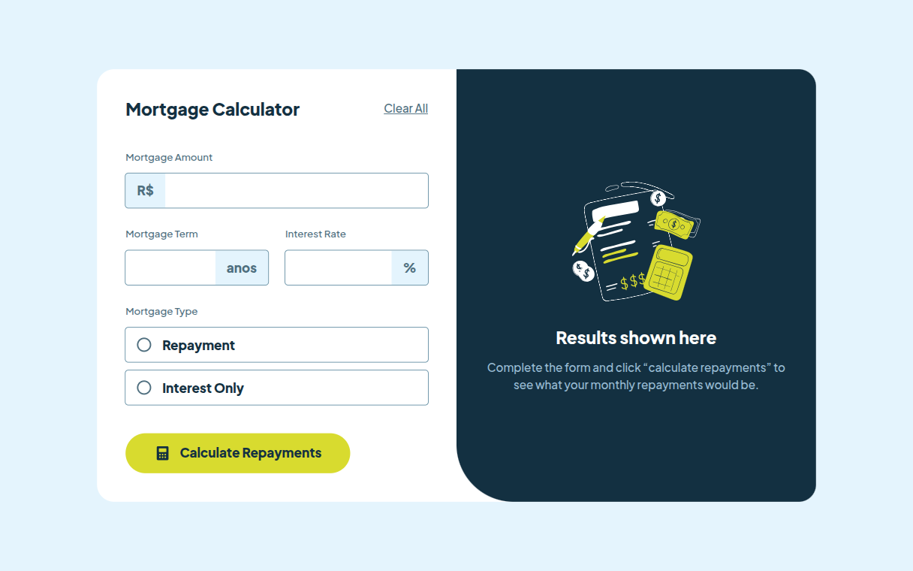
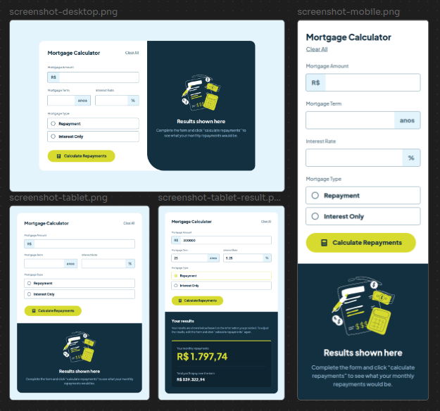

# Frontend Mentor - Mortgage repayment calculator solution

Esta é a minha solução para o [desafio Mortgage repayment calculator do Frontend Mentor](https://www.frontendmentor.io/challenges/mortgage-repayment-calculator-Galx1LXK73).



## Sumário

- [Visão Geral](#visão-geral)
   - [O desafio](#o-desafio)
   - [Screenshots](#screenshots)
   - [Links](#links)
   
## Visão Geral

### O desafio

O desafio é criar uma calculadora de pagamento de hipoteca e deixa-lá o mais parecida possível com o design do figma. Além de torna-lá funcional.


### Screenshots



### Links

- Link da solução: [Repositório](https://github.com/lucas-barbo/mortgage-repayment-calculator)
- Link do site: [GitHub Pages](https://lucas-barbo.github.io/mortgage-repayment-calculator/)

## Meu processo

### Tecnologias utilizadas

- HTML5 Semântico
- CSS
- JavaScript Vanilla (ES6+)

### O que aprendi

Ao escrever o HTML foquei em criar uma estrutura semantica e priorizar a acessibilidade. Para isso foi essencial usar tags como: **main**, **form**, **fieldset**, **label** e **section**.

No CSS implementie uma serie de praticas, que facilitam a acessibilidade e a manutenção posterior, defindi critérios de nomeação de classes e criando propriedades personalizadas (Variaveis). O que fiz:

- Usei variaveis, que facilita a alteração e a padronização do design.
- Metodologia BEM, que ajuda na estruturação, nomeação e navegação dentro dos arquivos .css.

```


├── forREADME
│   ├── screenshot-desktop.png
│   ├── screenshot-devices.png
│   ├── screenshot-mobile.png
│   └── screenshot-tablet.png
├── index.html
├── README.md
└── src
    ├── icons
    │   └── calculator.svg
    ├── img
    │   └── calculator-mortgage.svg
    ├── js
    │   └── script.js
    └── style
        ├── base
        │   └── variables.css
        ├── components
        │   ├── components.css
        │   └── typography.css
        ├── layout
        └── main.css
```